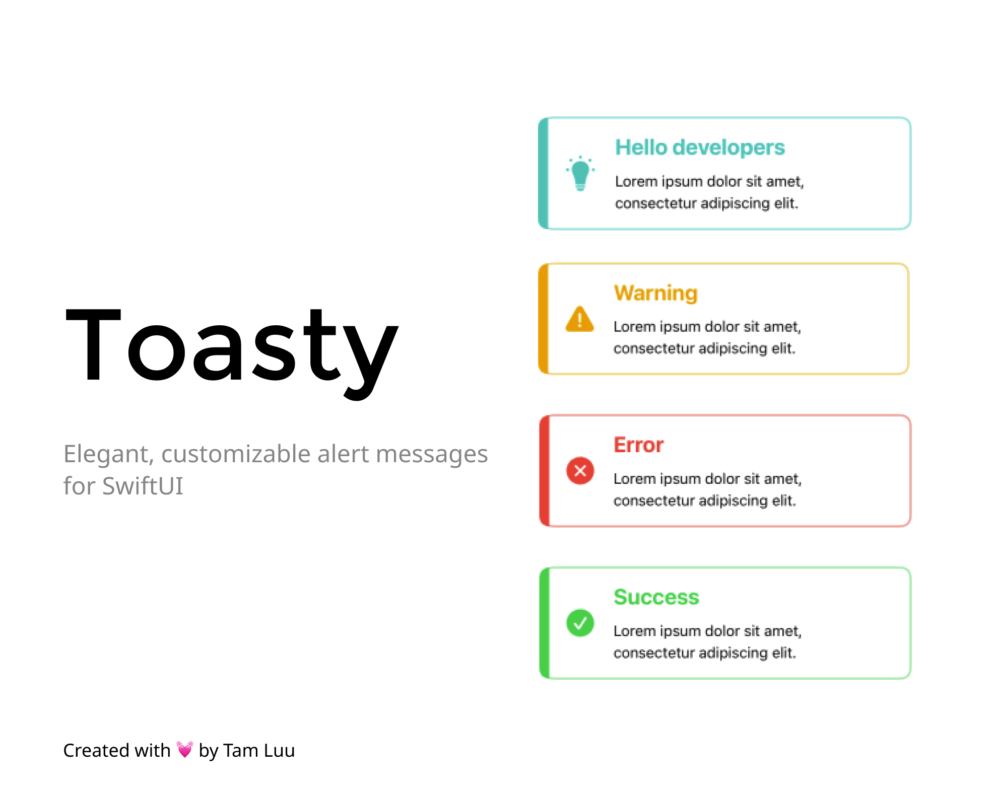

**Toasty** is a lightweight, customizable Swift package for displaying pop-up toast messages in SwiftUI applications. Designed to deliver timely feedback and notifications, Toasty allows developers to add sleek, informative messages to enhance user experience. With customizable options for content, appearance, and behavior, `Toasty` seamlessly integrates into any SwiftUI project to provide a polished and engaging way to communicate with users.

### 🚀 Features
- **Customizable Content**: Easily tailor toast messages with custom titles, messages, icons, and styles.
- **Adjustable Display Duration**: Set toast messages to appear for a custom duration, giving users enough time to view information without overstaying.
- **Flexible Positioning**: Display messages at the top or bottom of the screen, adapting to the app’s layout and user preferences.
- **Dynamic Styling Options**: Choose from predefined styles, such as warning, success, and error, or create custom styles to match your app’s theme.
- **Simple Integration**: Easily add Toasty to your SwiftUI views with a few lines of code, with minimal setup required.
- **State Management**: Control toast visibility using a single state variable, making it easy to show or hide messages based on user actions or events.

## ⛓️ Installation
### Swift Package Manager
To add `Toasty` to your Xcode project using Swift Package Manager, follow these steps:
1. Open your project in Xcode.
2. Go to `File` > `Add Package Dependencies...`.
3. Enter the URL of the `Toasty` repository:<br>
https://github.com/bii-08/Toasty.git
4. Select the package and click Add Package.

## Usage
 ### Importing the Package
 First, import the `Toasty` package in your SwiftUI view:
 ```swift
 import Toasty
 ```
### Using Toasty
```swift
import SwiftUI
import Toasty

struct SwiftUIView: View {
    
    /// State variable to manage the visibility of the toast message.
    @State private var showingToast = false
    
    var body: some View {
        NavigationStack {
            ZStack {
                VStack {
                    Text("Hello")
                    Button("Show toast") {
                        showingToast = true
                    }
                }
            }
            .ignoresSafeArea()
            .navigationTitle("Testing")
        }
        /// Attaches a `Toasty` view as an overlay toast message.
        .toast(toastView: Toasty(toast: Toast(title: "Warning",
                                              message: "Lorem ipsum dolor sit amet, consectetur adipiscing elit.",
                                              duration: 1,
                                              position: .top,
                                              type: .warning),
                          showToast: $showingToast))
    }
}
```
### Customization
You can customize the appearance and behavior of Toast by modifying the `Toast` struct parameters.

## Contributing
Contributions are welcome! If you find any issues or have suggestions for improvements, please open an issue or create a pull request.

## License
Toasty is released under the MIT License. See the LICENSE file for more information.
```
MIT License

Copyright (c) 2024 Tam Luu

Permission is hereby granted, free of charge, to any person obtaining a copy
of this software and associated documentation files (the "Software"), to deal
in the Software without restriction, including without limitation the rights
to use, copy, modify, merge, publish, distribute, sublicense, and/or sell
copies of the Software, and to permit persons to whom the Software is
furnished to do so, subject to the following conditions:

The above copyright notice and this permission notice shall be included in all
copies or substantial portions of the Software.

THE SOFTWARE IS PROVIDED "AS IS", WITHOUT WARRANTY OF ANY KIND, EXPRESS OR
IMPLIED, INCLUDING BUT NOT LIMITED TO THE WARRANTIES OF MERCHANTABILITY,
FITNESS FOR A PARTICULAR PURPOSE AND NONINFRINGEMENT. IN NO EVENT SHALL THE
AUTHORS OR COPYRIGHT HOLDERS BE LIABLE FOR ANY CLAIM, DAMAGES OR OTHER
LIABILITY, WHETHER IN AN ACTION OF CONTRACT, TORT OR OTHERWISE, ARISING FROM,
OUT OF OR IN CONNECTION WITH THE SOFTWARE OR THE USE OR OTHER DEALINGS IN THE
SOFTWARE.
```

